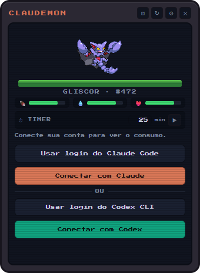
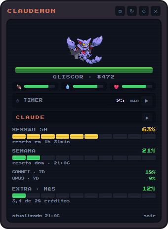
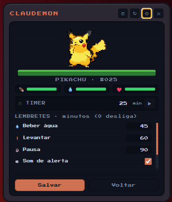

# Claudemon 🔴

Widget de desktop (Electron) que mostra o consumo da sua assinatura do **Claude** e/ou do **OpenAI Codex** com um Pokémon 8-bit aleatório dançando na tela. Dá pra conectar as duas IAs ao mesmo tempo e alternar entre elas com uma setinha. Sempre visível, arrastável, com ícone na bandeja.

## Como é

| Login | Consumo | Configurações |
|---|---|---|
|  |  |  |
| Conecte Claude e/ou Codex em 1 clique | Sessão 5h, semana e extra — ▶ alterna a IA | Lembretes, som e Pokémon fixo |

## ⬇️ Download

Baixe a versão mais recente, dê dois cliques e pronto:

| Sistema | Download |
|---|---|
| **Windows** (instalador, recomendado) | [Claudemon-Setup.exe](https://github.com/manowz/claudemon/releases/latest/download/Claudemon-Setup.exe) |
| **Windows** (portátil, sem instalar) | [Claudemon-Portable.exe](https://github.com/manowz/claudemon/releases/latest/download/Claudemon-Portable.exe) |
| **macOS** (Intel e Apple Silicon) | [Claudemon.dmg](https://github.com/manowz/claudemon/releases/latest/download/Claudemon.dmg) |

Todas as versões ficam na [página de releases](https://github.com/manowz/claudemon/releases).

> **Windows**: sem assinatura de código, o SmartScreen pode avisar "aplicativo não reconhecido" — clique em *Mais informações → Executar assim mesmo*.
>
> **macOS**: como o app não é notarizado pela Apple, na primeira abertura o macOS pode bloquear. Vá em *Ajustes do Sistema → Privacidade e Segurança → "Abrir mesmo assim"*, ou rode `xattr -cr /Applications/Claudemon.app` no Terminal.

## O que ele mostra

| Bloco | Claude | Codex |
|---|---|---|
| **Sessão 5h** | janela de uso atual + contagem regressiva do reset | idem (janela primária) |
| **Semana** | limite semanal (7 dias) + dia/hora do reset | idem (janela secundária) |
| **Sonnet/Opus 7d** | sub-limites semanais por modelo (conforme o plano) | — |
| **Extra · Mês / Plano** | créditos de *extra usage* usados no mês vs. limite | plano da conta (Plus/Pro/…) + saldo de créditos |

> Nem o Claude nem o Codex têm limite "diário" — os limites reais das assinaturas são a **sessão de 5 horas** e a **janela semanal**. O widget mostra exatamente essas janelas.

Os dados vêm de `GET https://api.anthropic.com/api/oauth/usage` (o mesmo endpoint que alimenta o `/usage` do Claude Code) e, para o Codex, de `GET https://chatgpt.com/backend-api/wham/usage` (o mesmo que alimenta o `/status` do Codex CLI).

## Rodando

Requisitos: Node 18+.

```bash
npm install
npm start
```

## Login

### Claude

1. **Usar login do Claude Code** — se o Claude Code já está logado na máquina (`~/.claude/.credentials.json`), o botão aparece e conecta em 1 clique. Quando esse token expira, o widget apenas **relê o arquivo** (nunca usa o refresh token do Claude Code, para não derrubar a sessão dele). Se ficar expirado, abra o Claude Code uma vez.
2. **Conectar com Claude** — fluxo OAuth+PKCE: abre o navegador em `claude.ai/oauth/authorize`, você autoriza, a página de callback mostra um código no formato `codigo#state` — cole no widget. O refresh é automático depois disso.

### Codex (plano ChatGPT)

1. **Usar login do Codex CLI** — se o Codex CLI já está logado na máquina (`~/.codex/auth.json`), o botão aparece e conecta em 1 clique. Vale a mesma regra do Claude Code: o widget só **lê o access token** e relê o arquivo quando expira — **nunca** usa o refresh token do CLI (ele rotaciona com detecção de reuso; um refresh externo derrubaria a sessão do Codex). Se ficar expirado, use o Codex CLI uma vez.
2. **Conectar com Codex** — fluxo OAuth+PKCE igual ao do próprio Codex CLI: abre o navegador em `auth.openai.com`, você entra com a conta ChatGPT e o widget recebe o retorno sozinho por um servidor local em `http://localhost:1455/auth/callback` (nada de colar código). Depois disso o refresh é automático. Se o Codex CLI estiver no meio de um login, a porta 1455 pode estar ocupada — conclua ou cancele lá e tente de novo.

### As duas ao mesmo tempo

Dá pra deixar **Claude e Codex conectados simultaneamente**: com um conectado, o botão **+** no topo do dashboard leva de volta à tela de login para conectar o outro. Com os dois conectados, a **setinha ▶** no canto direito alterna qual consumo está na tela (o widget continua sondando os dois em segundo plano). O *sair* desconecta só a IA exibida.

Os tokens ficam **somente na sua máquina**, criptografados via `safeStorage` (DPAPI no Windows), em `%APPDATA%/claudemon/config.json`.

## Pokémon

Sprites animados da **Geração V (Black/White)** via PokeAPI — pixel art com animação de idle (a "dança"). A cada abertura do widget sorteia um dos 649 (nunca repete o anterior imediato). O botão ⚄ na barra sorteia outro; clicar no bicho faz carinho (e ele pula). Pokémon © Nintendo/Game Freak — uso pessoal.

**Pokémon fixo**: nas configurações (⚙) dá pra escolher um Pokémon permanente pelo nome em inglês (ex.: `pikachu`) ou pelo número (ex.: `25`). Com um fixo definido, ele aparece sempre que o widget abre; o ⚄ ainda sorteia outro temporariamente. Deixe o campo vazio para voltar ao sorteio.

## Tamagotchi 🍖💧❤️

O Pokémon tem três necessidades que caem com o tempo (inclusive com o widget fechado, com piso de 10%): **fome**, **sede** e **carinho**. Os botões abaixo do nome alimentam, dão água e fazem carinho; clicar no próprio Pokémon também conta como carinho. Quando alguma necessidade fica baixa, ele reclama num balão de fala e fica "tristinho" (dessaturado). Estado salvo localmente (localStorage).

## Lembretes 💧🧍☕

O Pokémon te lembra de **beber água**, **levantar/alongar** e **fazer pausas** em intervalos configuráveis (engrenagem ⚙ na barra de título; 0 desliga). O lembrete aparece como balão de fala + pulinhos + bip 8-bit opcional.

## Alerta de consumo ⚠️

O Pokémon avisa quando a **sessão de 5h** atinge um limiar configurável (padrão **50%**; 0 desliga): balão "⚠️ SEUS TOKENS ESTÃO ACABANDO!" com a IA e o percentual, pulinhos e bip 8-bit (respeita o "som de alerta" das configurações — sem som, o balão continua aparecendo). Dispara **uma vez por janela de 5h** e volta a avisar quando a sessão reseta ou quando você muda o limiar. Com Claude e Codex conectados, cada IA alerta por conta própria, mesmo a que não está na tela.

## Timer / Pomodoro ⏱

Linha do timer abaixo das necessidades: digite os minutos (ex.: 25 para um pomodoro) e aperte ▶. Ao terminar, o Pokémon chacoalha, mostra "⏰ DEU O TEMPO!" e apita até você clicar nele (ou no balão) — auto-desliga em 60s.

## Configurações ⚙

Botão de engrenagem ao lado do de atualizar: intervalos de cada lembrete (água, levantar, pausa), limiar do alerta de uso da sessão (%), som de alerta on/off, "sempre visível" (janela acima de todas as outras, nível `screen-saver`) e o Pokémon fixo. Persistem em `%APPDATA%/claudemon/config.json`.

## Bandeja (tray)

Atualizar agora · Trocar Pokémon · Sempre visível · Iniciar com o sistema · Sair.

## Avisos importantes

- Os endpoints `api/oauth/usage`, `api/oauth/profile` e o fluxo OAuth do Claude Code **não são API pública documentada**. A Anthropic pode mudá-los ou restringi-los a qualquer momento — se quebrar, provavelmente foi isso.
- Idem para o Codex: `backend-api/wham/usage` e o OAuth de `auth.openai.com` são os endpoints internos do Codex CLI, não uma API pública. A OpenAI pode mudá-los sem aviso (constantes em `src/codex.js`).
- O widget usa os tokens **apenas para ler o consumo** (nunca para inferência). Uso de OAuth de assinatura para inferência em apps de terceiros é justamente o que os provedores vêm bloqueando.
- O `User-Agent` das chamadas de usage do Claude é `claude-code/<versão>` porque, sem esse formato, o endpoint responde `429` (bucket de rate limit agressivo). Constante em `src/usage.js`.
- Polling padrão: a cada 2 min, com backoff até 15 min em caso de 429 (`POLL_MS` em `main.js`).
- Se o login OAuth do Claude retornar `403` no usage, edite `SCOPES` em `src/oauth.js` (adicione `user:sessions:claude_code`) e refaça o login.

## Distribuindo para outras pessoas

A publicação é **automática**: ao enviar uma tag de versão, o GitHub Actions (`.github/workflows/release.yml`) compila o instalador do Windows (num runner Windows) e o `.dmg` do Mac (num runner macOS — dmg não se gera no Windows) e anexa tudo num GitHub Release. Os links da seção *Download* acima apontam sempre para a versão mais recente.

```bash
# fluxo de release (detalhes no CLAUDE.md):
# 1. suba a "version" no package.json   2. commit + push   3. tag:
git tag v1.2.0
git push origin v1.2.0
```

Para gerar localmente (teste antes de publicar): `npm run dist` (Windows) ou `npm run dist:mac` (rodando num Mac). Saída em `dist/`:

| Arquivo | O que é |
|---|---|
| `Claudemon-Setup.exe` | **Instalador** (recomendado) — 1 clique, instala por usuário (sem pedir admin), cria atalho no menu Iniciar e desinstalador |
| `Claudemon-Portable.exe` | **Portátil** — um exe único, roda direto sem instalar (bom pra pendrive/pasta compartilhada) |
| `Claudemon.dmg` | **Mac** — imagem universal (Intel + Apple Silicon), arrasta pra pasta Aplicativos |

Os tokens de cada usuário ficam só na máquina dele (`%APPDATA%/claudemon` no Windows, `~/Library/Application Support/claudemon` no Mac), nada é compartilhado no exe.

**Sobre os avisos de segurança**: os binários não têm assinatura de código (certificado pago) nem notarização da Apple — daí os avisos do SmartScreen/Gatekeeper descritos na seção *Download*. Para sumir com eles seria preciso um certificado de code signing (Windows) e uma conta Apple Developer com notarização (Mac).

## Estrutura

```
claudemon/
├── main.js            # janela, tray, IPC, polling, ciclo dos tokens
├── preload.js         # ponte segura p/ o renderer
├── src/
│   ├── config.js      # persistência + criptografia dos tokens
│   ├── oauth.js       # Claude: PKCE, troca/refresh, import do Claude Code
│   ├── codex.js       # Codex: PKCE + callback local, refresh, import do CLI, usage
│   └── usage.js       # Claude: GET usage/profile
├── renderer/          # UI (HTML/CSS/JS puro)
└── assets/            # ícones (pokébola)
```
